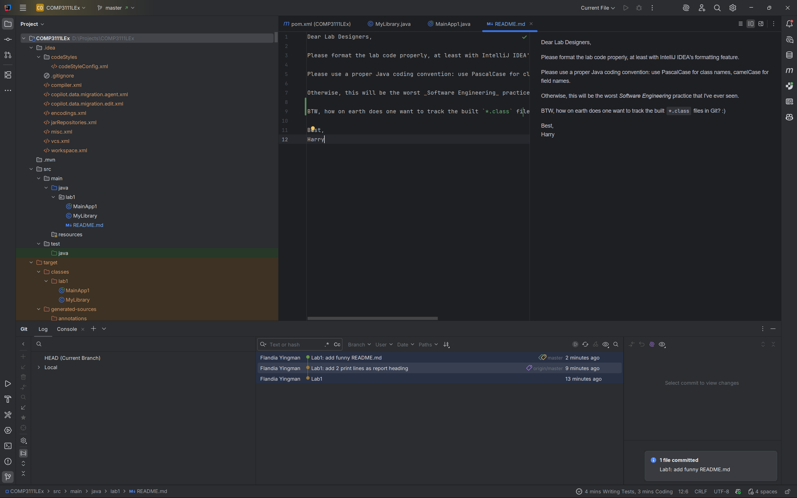

Dear Lab Designers,

Please format the lab code properly, at least with IntelliJ IDEA's formatting feature.

Please use a proper Java coding convention: use PascalCase for class names, camelCase for field names.

Otherwise, this will be the worst _Software Engineering_ practice that I've ever seen.

BTW, how on earth does one want to track the built `*.class` files in Git? :) 

Best,  
Harry